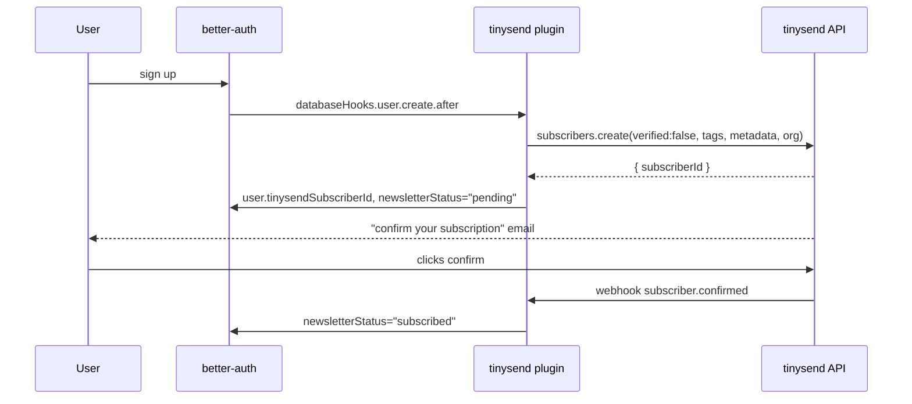
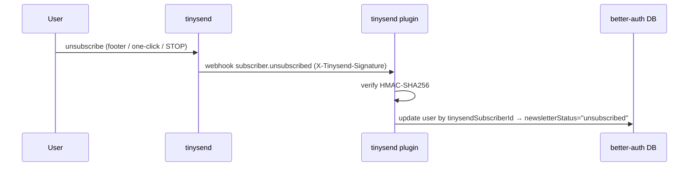

# @tinysend/better-auth

Turn your [better-auth](https://better-auth.com) users into a consented
[tinysend](https://tinysend.com) audience. Sign-ups become subscribers on a list
you can broadcast to, with tags + metadata synced onto the contact, account
security emails, and unsubscribes that propagate back into your database.

Two parts, use either or both:

- `tinysend()` — a real better-auth plugin: audience sync + security notifications + unsubscribe webhook
- `senders` — option adapters that route better-auth's own emails (verification, reset, magic link, OTP) through tinysend

```bash
npm install better-auth tinysend @tinysend/better-auth
```

## The audience plugin

```ts
import { betterAuth } from 'better-auth';
import { tinysend } from '@tinysend/better-auth';

export const auth = betterAuth({
  plugins: [
    tinysend({
      apiKey: process.env.TINYSEND_API_KEY!,
      listId: 'lst_...',                 // the list users land on
      appUrl: 'https://your-app.com',    // for the unsubscribe webhook
      optIn: 'double',                   // 'double' (default) | 'single'
      // map a user onto the tinysend contact (all additive, nothing is ever cleared):
      mapContact: (user) => ({
        tags: ['from:app', user.plan === 'pro' ? 'pro' : 'free'],
        metadata: { plan: user.plan, signup_source: 'web' },
        org: user.company,
        jobTitle: user.role,
      }),
    }),
  ],
});
```

Run the better-auth schema generation after adding it (it adds two fields to `user`
and a small `tinysendWebhook` table):

```bash
npx @better-auth/cli generate
```

### How sign-up sync works (double opt-in)



With `optIn: 'single'` the user is subscribed immediately (`verified:true`, no
confirmation email) — use only when your sign-up form carries explicit consent.

### Unsubscribe always propagates back

Unsubscribe anywhere — your in-app toggle, the email footer link, one-click
`List-Unsubscribe`, or replying STOP — and the user row stays in sync.



The plugin self-registers that webhook on first sync (`registerWebhook`, default on)
and stores its signing secret to verify deliveries.

### Client

```ts
import { createAuthClient } from 'better-auth/client';
import { tinysendClient } from '@tinysend/better-auth/client';

export const authClient = createAuthClient({ plugins: [tinysendClient()] });

await authClient.tinysend.subscribe();
await authClient.tinysend.unsubscribe();
const { status } = await authClient.tinysend.preferences();
```

### Tags + metadata

`mapContact` writes onto the global tinysend contact, additively:

- `tags` — person-level labels, unioned with existing. They render in Apple Contacts as vCard CATEGORIES (tinysend runs a CardDAV server), and drive segment sends.
- `metadata` — arbitrary key/values, shallow-merged. For filtering/segmentation and display.
- `org` / `jobTitle` — written to the contact's identity fields.

Nothing is ever removed by a sync, so re-running with a subset of fields is safe.

## Security notifications

The plugin also emails the user after events better-auth has no built-in callback
for — password changed, email changed, 2FA enabled/disabled. These never block the
auth operation; failures go to `onError`. Disable per event with
`notifications: { passwordChanged: false }`, or all with `notifications: false`.

## Senders (route better-auth's own emails through tinysend)

```ts
import { betterAuth } from 'better-auth';
import { magicLink, emailOTP } from 'better-auth/plugins';
import { Tinysend } from 'tinysend';
import { senders } from '@tinysend/better-auth';

const ts = new Tinysend(process.env.TINYSEND_API_KEY!);

betterAuth({
  emailVerification: { sendVerificationEmail: senders.verification(ts) },
  emailAndPassword: { enabled: true, sendResetPassword: senders.reset(ts) },
  plugins: [
    magicLink({ sendMagicLink: senders.magicLink(ts) }),
    emailOTP({ sendVerificationOTP: senders.otp(ts) }),
  ],
});
```

Senders available: `verification`, `reset`, `magicLink`, `otp`, `twoFactorOtp`,
`changeEmail`, `deleteAccount`, `invitation`. Each takes an optional template to
override subject / html / text / tag. Replies land in a real tinysend mailbox.

## License

MIT — a [system operator](https://systemoperator.com) product.
